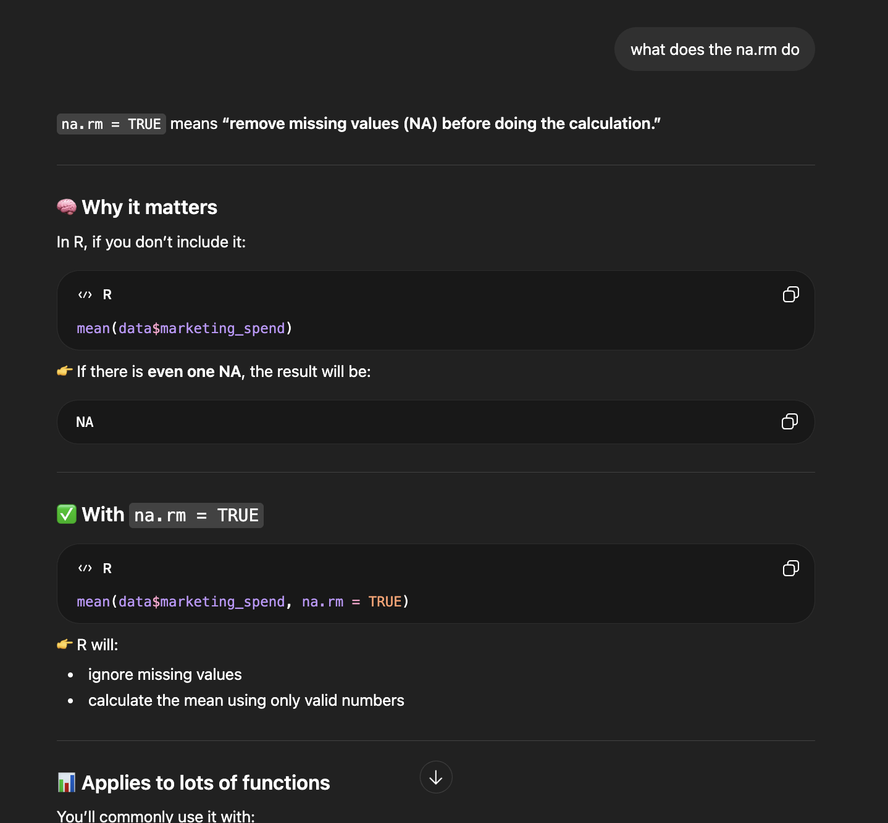
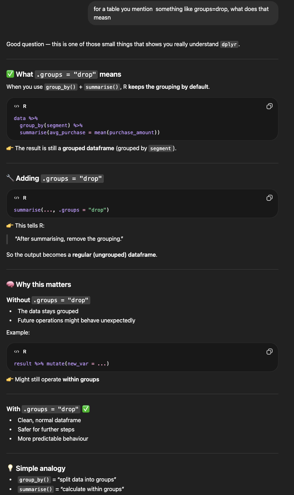
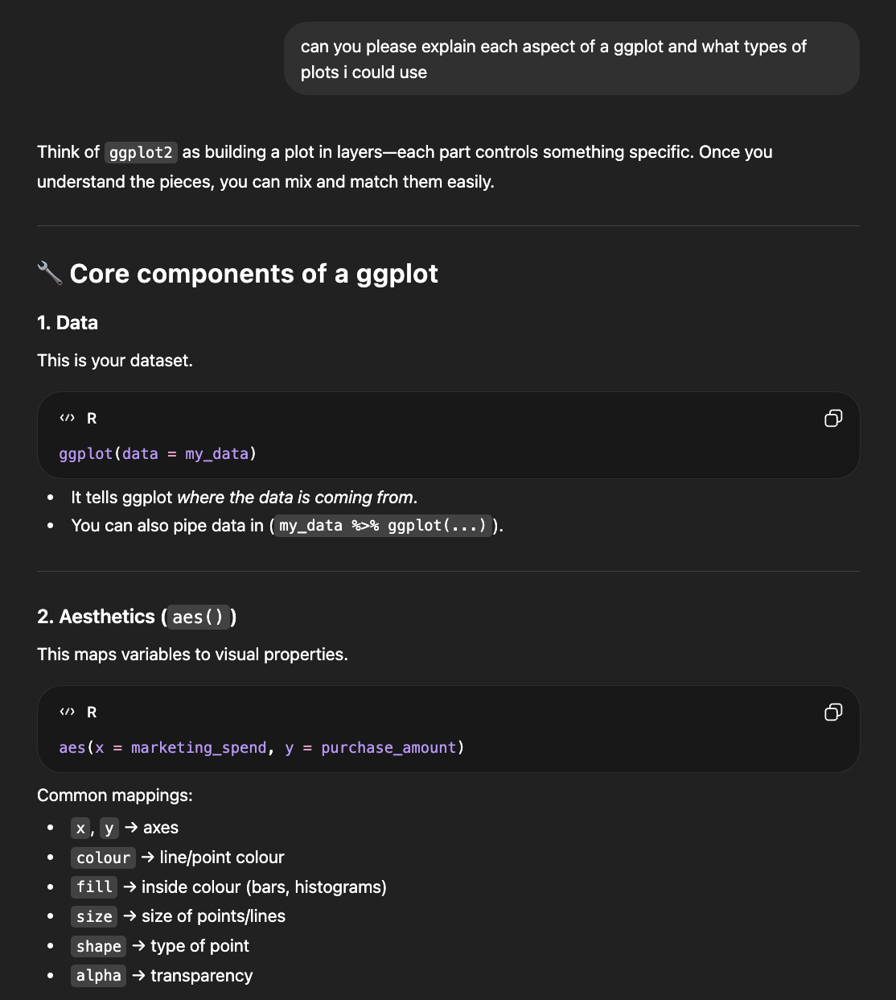
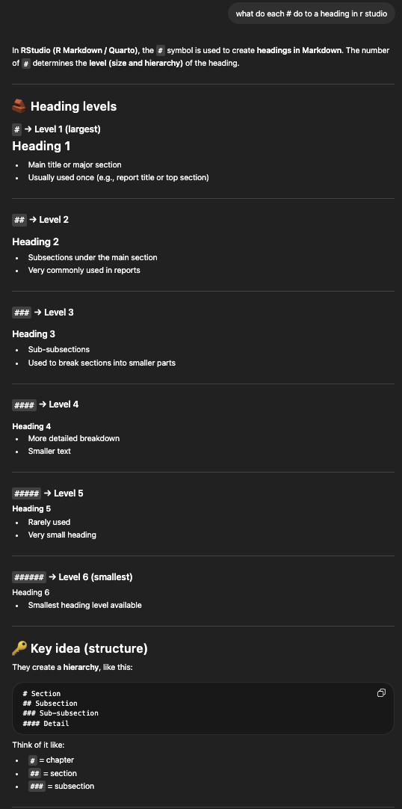
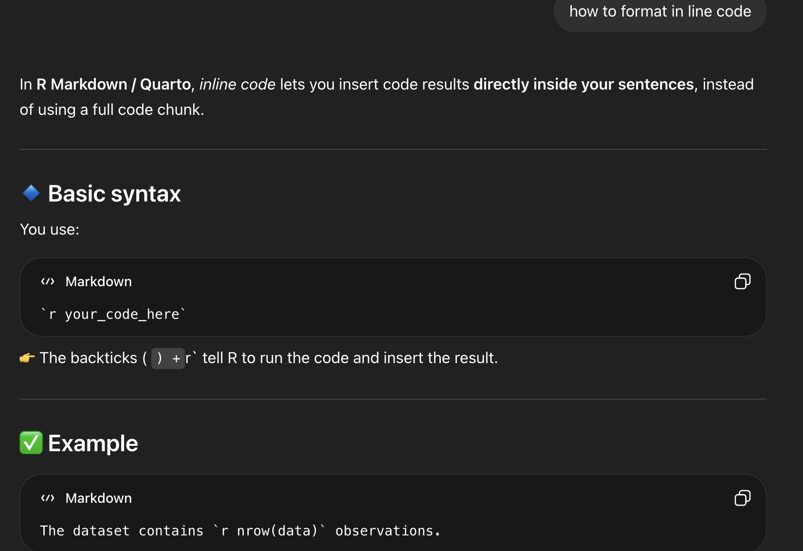
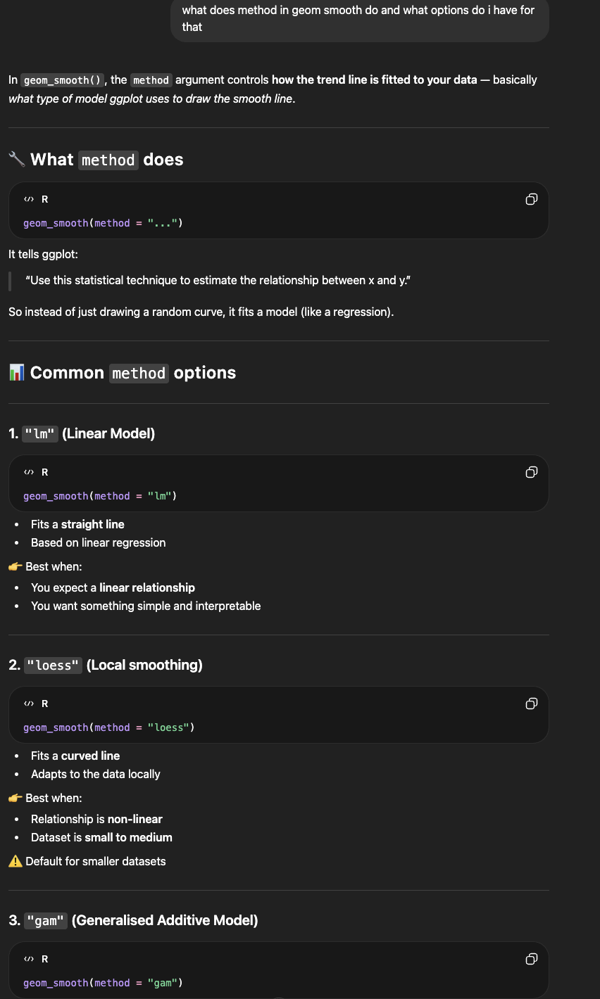

## AI Use Statement

Generative AI was used in a limited support capacity for this assignment. Its use was restricted to assisting with R code, such as troubleshooting errors, improving plot presentation, and refining existing code structure. All analysis, interpretation, and final decisions were completed independently.

## Examples of AI Assistance

- Troubleshooting R code errors
- Suggesting improvements to ggplot visualisations
- Assisting with formatting in Quarto

## Screenshots of AI Queries and Interactions

### Example 1

### Example 2

### Example 3

### Example 4

### Example 5

### Example 6
